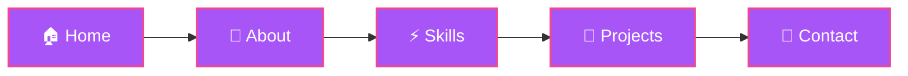

# 💼 Ivan Vysocinas - Portfolio

<div align="center">


[](https://git.io/typing-svg)

</div>

## 🚀 About This Project

Modern, animated portfolio website built with cutting-edge technologies. Features smooth animations, dark theme, and responsive design that works seamlessly across all devices.

<div align="center">


</div>

## ✨ Features

<table>
<tr>
<td width="50%">

### 🎨 Design
- Modern dark theme with purple/pink gradients
- Smooth scroll animations
- Interactive hover effects
- Responsive mobile-first design
- Glass morphism effects

</td>
<td width="50%">

### ⚡ Performance
- Lightning-fast load times with Vite
- Optimized animations with Framer Motion
- Lazy loading images
- Code splitting
- SEO optimized

</td>
</tr>
</table>

## 📱 Sections



### 🏠 Hero Section
Eye-catching landing with animated text and gradient effects

### 👤 About Me
Personal introduction with tech stack showcase

### ⚡ Skills
Interactive skill cards with scroll-triggered animations
- Auto-animated on mobile when in viewport
- Hover effects on desktop
- Categorized by Frontend, Backend, Tools, etc.

### 🚀 Projects
Carousel showcase of featured projects
- Responsive slider (3 cards on desktop, 2 on tablet, 1 on mobile)
- Smooth animations
- Direct links to GitHub and live demos

### 📧 Contact
Functional contact form with EmailJS integration
- Real-time validation
- Beautiful toast notifications
- Direct email sending

## 🛠️ Tech Stack

<div align="center">

| Category | Technologies |
|----------|-------------|
| **Frontend** | React 18, TypeScript, Tailwind CSS |
| **Animation** | Framer Motion |
| **Build Tool** | Vite |
| **Email** | EmailJS |
| **Icons** | Lucide React |

</div>

## 📦 Installation

```bash
# Clone the repository
git clone https://github.com/Toxicyy/portfolio

# Navigate to project directory
cd portfolio

# Install dependencies
npm install

# Install EmailJS
npm install @emailjs/browser

# Start development server
npm run dev

# Build for production
npm run build

# Preview production build
npm run preview
```

## ⚙️ Configuration

### EmailJS Setup

1. Create account at [EmailJS](https://www.emailjs.com/)
2. Add your credentials in `ContactSection.tsx`:

```typescript
const serviceId = 'your_service_id';
const templateId = 'your_template_id';
const publicKey = 'your_public_key';
```

3. Create email template with variables: `{{from_name}}`, `{{from_email}}`, `{{message}}`

## 🎯 Project Structure

```
portfolio/
├── src/
│   ├── components/
│   │   ├── Portfolio/
│   │   │   ├── AboutSection.tsx
│   │   │   ├── animations.ts
│   │   │   ├── constants.ts
│   │   │   ├── ContactSection.tsx
│   │   │   ├── Footer.tsx
│   │   │   ├── HeroSection.tsx
│   │   │   ├── Navigation.tsx
│   │   │   ├── ProjectPage.tsx
│   │   │   ├── ProjectsSection.tsx
│   │   │   ├── ScrollReveal.tsx
│   │   │   ├── SkillsSection.tsx
│   │   │   └── StarField.tsx
│   │   └── ui/
│   │       ├── Badge.tsx
│   │       ├── Button.tsx
│   │       ├── Card.tsx
│   │       ├── index.ts
│   │       ├── Input.tsx
│   │       ├── Modal.tsx
│   │       ├── Tabs.tsx
│   │       └── TextArea.tsx
│   ├── images/
│   ├── types/
│   │   └── types.ts
│   ├── CustomHooks.ts
│   ├── data.tsx
│   ├── index.css
│   ├── main.tsx
│   └── Portfolio.tsx
└── package.json
```

## 📊 Performance

<div align="center">


</div>

## 🤝 Contributing

Contributions, issues, and feature requests are welcome!

## 📧 Contact

<div align="center">

[](mailto:firstpicktinker@gmail.com)
[](https://github.com/Toxicyy)
[](https://t.me/Bugzers)

</div>

---

<div align="center">

### ⭐ Star this repo if you like it!


Made with 💜 by [Ivan Vysocinas](https://github.com/Toxicyy)


</div>